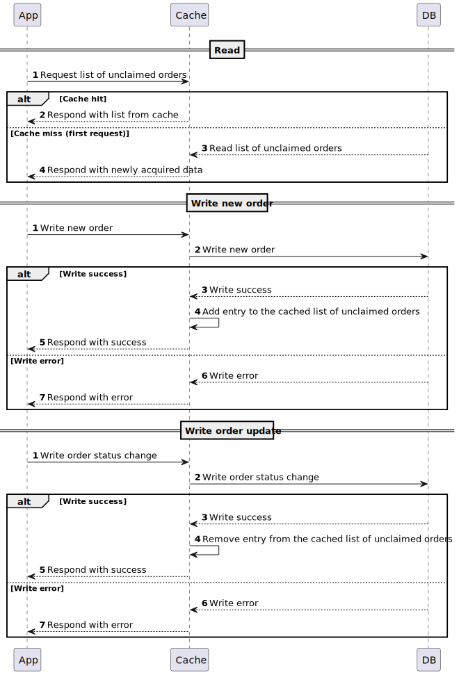

# Архитектурное решение по кешированию

## Мотивация
Кеширование списка новых заказов в MES API позволит:
 - Увеличить степень удовлетворения операторов путём кеширования списка новых заказов 
 - Увеличить количество выполняемых заказов путём оптимизации работы операторов
 - Уменьшить нагрузку на систему MES API путём уменьшения количества запросов к базе данных

## Предлагаемое решение
В данном случае требуется серверное кеширование, т.к. кеш должен быть общий для всех операторов и обновляться для всех операторов сразу при изменении списка новых заказов.

### Запись
Для записи требуется использоваться Write-Through, т.к. нам необходимо поддерживать список заказов, не закреплённых за оператором. Соответственно, нужно оперативно и консистентно обновлять кэш в момент закрепления заказа за оператором чтобы исключить его из вывода для других операторов. Задержка выполнения записи в кеш и в базу не является проблемой в данной ситуации, т.к. 
1. операции записи происходят не так часто - сотни или тысячи в месяц, т.е. единицы записи в минуту
2. пользователь - сотрудник компании, для которого ожидание в секунду или две не будет преградой

Write-Behind подойдёт хуже, т.к. по описанным выше причинам не требуется мгновенного ответа на запрос, а консистентность данных ставится под угрозу. 

### Чтение
Чтобы обеспечивать чтение в такой конфигурации подойдёт Read-Through, т.к. он обеспечивает ожидаемую консистентность данных, а модель данных в кеше соответствует модели базы данных. В сочетании с Write-Through позволит создать единую прослойку между приложением и базой даннных. Однако может потребовать некоторой логики по инициализации кеша на стороне приложения.

Cache-Aside - т.к. запись проходит через кеш, устойчивость в сбоям кеша данного паттерна не актуальна. При этом данный паттерн принесёт 2 способа работы с данными и может негативно повлиять на согласованность данных.

Refresh-Ahead - подходит в том отношении, что заранее известно какие данные потребуются потребителю, но из-за требований к консистентности асинхронное обновление по времени подходит меньше.

### Диаграмма последовательности

### Инвалидация кеша

| Инвалидация на основе изменений                                                        | Программная инвалидация                                                                  | Инвалидация, основанная на запросах                                         | Временная                                                    | Инвалидация по ключу                                                           |
|----------------------------------------------------------------------------------------|------------------------------------------------------------------------------------------|-----------------------------------------------------------------------------|--------------------------------------------------------------|--------------------------------------------------------------------------------|
| + Является стандартным подходом, который имеет готовые реализации                      | + Позволяет максимульную гибкость и точечность инвалидации согласно с логикой приложения | + Относительная простота реализация                                         | + Простота реализации                                        | + Приложение обновлять записи по-одному, таким образом ключ изменения известен |
| + Поддерживает консистентность данных                                                  | + Поддерживает консистентность данных                                                    | + Поддерживает консистентность данных при изменении запросами пользователей | - Не поддерживает консистентность данных                     | - Требуется поддерживать кэш списка записей, потому не актуально               |
| - Кэш потребует настройки под конкретное применения, его не получится переиспользовать | - Требует явной реализации на стороне приложения                                         | - Не учитывает изменения данных через очередь сообщений                     | - Не испольует доступные знания о паттернах изменения данных |                                                                                |

Исходя из таблицы выше оптимальным выглядит подход Инвалидации на основе изменений, он отвечает требованиям консистентности данных и не потребует обширной разработки.